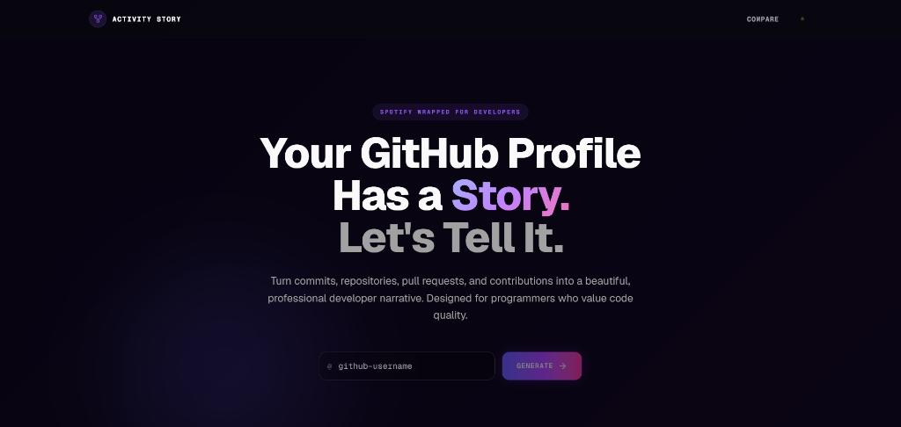
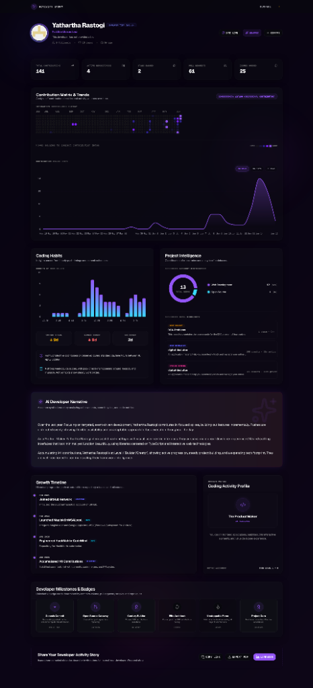
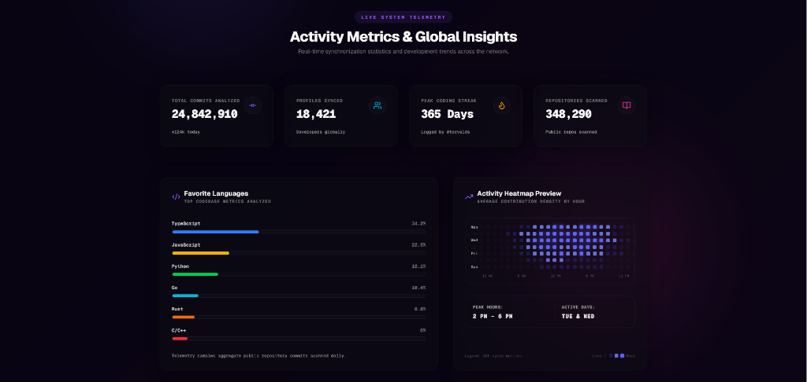

# ⚡ GitHub Recapped

<div align="center">
  <p><b>Spotify Wrapped for Developers.</b> Turn commits, repositories, pull requests, and contribution history into a stunning, interactive visual narrative.</p>

  <!-- Badges -->
  <a href="https://nextjs.org/"></a>
  <a href="https://react.dev/"></a>
  <a href="https://tailwindcss.com/"></a>
  <a href="https://prisma.io/"></a>
  <a href="https://framer.com/motion/"></a>
  <a href="https://recharts.org/"></a>
</div>

---

## 📸 Showcase

Explore the interface of **GitHub Recapped**:

### 1. Developer Landing Page
*Enter any public GitHub username to generate their story instantly. Features glassmorphic cards, glowing element cards, and active community telemetry stats.*

<p align="center">
  
</p>

### 2. Interactive Story Dashboard
*A detailed summary of your engineering metrics: Contribution Matrix, Coding Habits, Project Intelligence (language compositions), AI Developer Narrative, Growth Milestones, and unlockable badges.*

<p align="center">
  
</p>

### 3. Global Activity Metrics & Telemetry
*A global snapshot of activity aggregated from public developers, favorite languages analysis, and a dense contribution heatmap.*

<p align="center">
  
</p>

---

## 🚀 Key Features

*   **🔍 No-Token Public Scraper**: Fetches real daily metrics directly from public GitHub contributions without requiring personal access tokens or OAuth authorizations. Supports instant synchronization via a "Sync Live" cache bypass.
*   **🌟 Developer Spotlight Cards**: Featured profiles on the home screen render as high-fidelity interactive cards with elegant hover glows and detailed metric grids.
*   **🏆 Tiering & Archetypes**: Automatically analyzes commit volumes to determine developer tiers (Level 1 to 5) and activity archetypes.
*   **🎬 Immersive Wrapped Slide Deck**: Spotify Wrapped-style slideshow mapping out flagship codebases, active hours, streaks, and top milestones with dynamic slide transitions.
*   **🥊 Side-by-Side Comparison Arena**: A comparison board where two developers can compare statistics side-by-side, highlighting key metric leads.
*   **📊 Premium Data Visualizations**: Custom-styled Recharts elements featuring linear gradient area plots, rounded corner bar charts, custom donut legends, and glowing electric violet heatmap blocks.
*   **✨ High-Fidelity Glassmorphism**: Built with fluid light and dark animated background gradient meshes, letting background colors flow visibly underneath the glassmorphic panels.

---

## 🛠️ Tech Stack

| Technology | Version | Purpose |
| :--- | :--- | :--- |
| **Next.js** | `16.2.9` | App Router, server-side rendering, and API routing |
| **React** | `19.2.4` | Component-driven UI architecture and hook state |
| **Tailwind CSS** | `v4` | CSS-first styling and class-based dark mode variants |
| **Framer Motion** | `12.40.0` | Staggered spring animations and rolling counters |
| **Recharts** | `3.8.1` | SVG-based gradients and interactive tooltips |
| **Prisma ORM** | `6.19.3` | Caching engine with SQLite local storage (`dev.db`) |
| **Canvas Confetti** | `1.9.4` | Celebration particles triggered on success states |

---

## 📁 Project Structure

```
├── prisma/                  # Prisma Database schema and SQLite local store
│   ├── dev.db               # Local SQLite database cache
│   └── schema.prisma        # Database models (GithubStory, Comparison)
└── src/
    ├── app/                 # Next.js App Router (Layouts, API endpoints, views)
    │   ├── api/             # API routes for scraping and comparison matching
    │   ├── compare/         # Developer matchup comparison arena page
    │   ├── story/           # Custom stats dashboard and developer archetypes
    │   └── wrapped/         # Fullscreen Spotify Wrapped slideshow deck
    ├── components/          # Reusable shared UI elements and cards
    │   ├── charts/          # Custom Recharts components (active-hours, heatmap)
    │   └── ui/              # Primitive buttons, inputs, and animated elements
    └── lib/                 # Core scraping engine and database helper layers
```

---

## ⚙️ Getting Started

Follow these steps to run the project locally on your machine.

### Prerequisites

*   **Node.js** (v18 or higher recommended)
*   **npm** (or yarn, pnpm, bun)

### Local Installation

1. **Clone the Repository**
   ```bash
   git clone https://github.com/yathartharastogi/Github-Recapped.git
   cd Github-Recapped
   ```

2. **Install Dependencies**
   ```bash
   npm install
   ```

3. **Prisma SQLite Setup**
   Ensure the local SQLite database schema is configured and matching:
   ```bash
   npx prisma db push
   ```

4. **Start the Development Server**
   ```bash
   npm run dev
   ```
   Open [http://localhost:3000](http://localhost:3000) in your browser.

---

## 💡 How It Works

1. **Public Scraping**: When a username is requested, the application fetches the user's public profile page and contributions calendar from GitHub's public endpoints.
2. **Aggregating Stats**: Parses total commits, pull requests, issues, active streak count, contribution density, and repositories.
3. **Determining Tier & Archetypes**: Evaluates the intensity and consistency of contributions to assign a developer level (Level 1-5) and select an archetype (e.g. "Unstoppable Force", "Century Builder", "Open Source Gateway", etc.).
4. **Caching & DB Synchronization**: Stores results in the Prisma SQLite database for quick load times. The cache can be bypassed at any time using the "Sync Live" functionality on the dashboard.

---

## 🤝 Contributing

Contributions make the developer community an amazing place to learn, inspire, and create. Any contributions you make are **greatly appreciated**.

1. Fork the project.
2. Create your feature branch (`git checkout -b feature/AmazingFeature`).
3. Commit your changes (`git commit -m 'Add some AmazingFeature'`).
4. Push to the branch (`git push origin feature/AmazingFeature`).
5. Open a Pull Request.

---

<p align="center">
  Built with 💜 for developers who value visual metrics.
</p>
